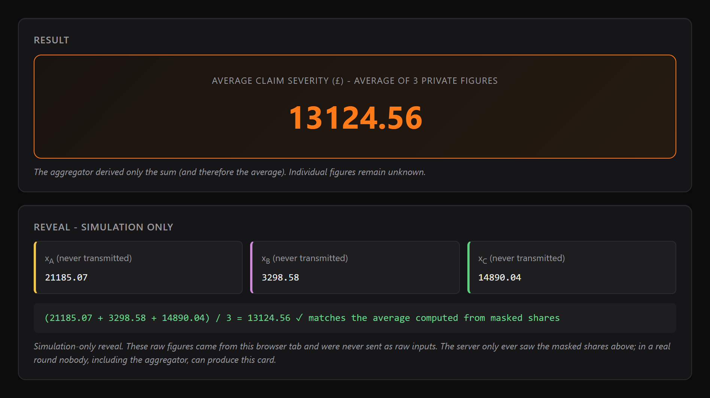
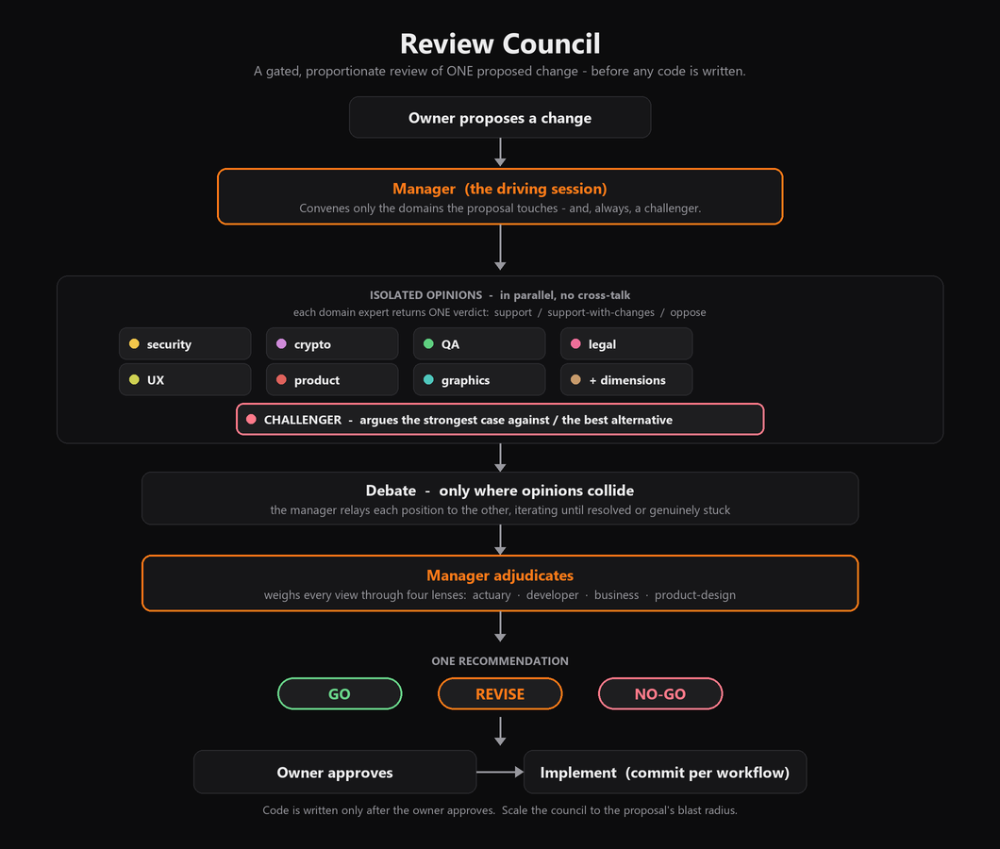
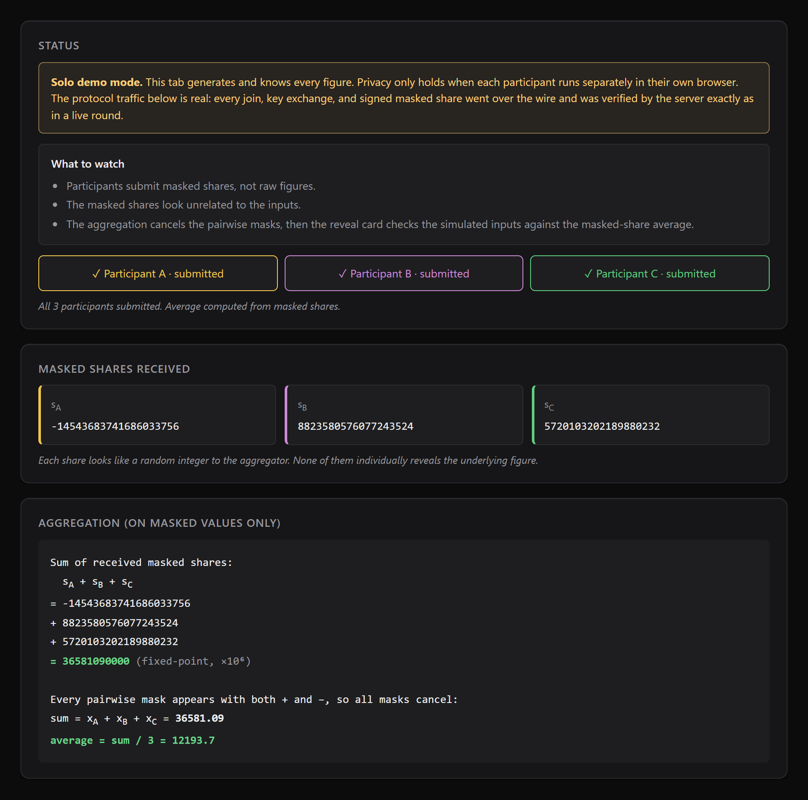
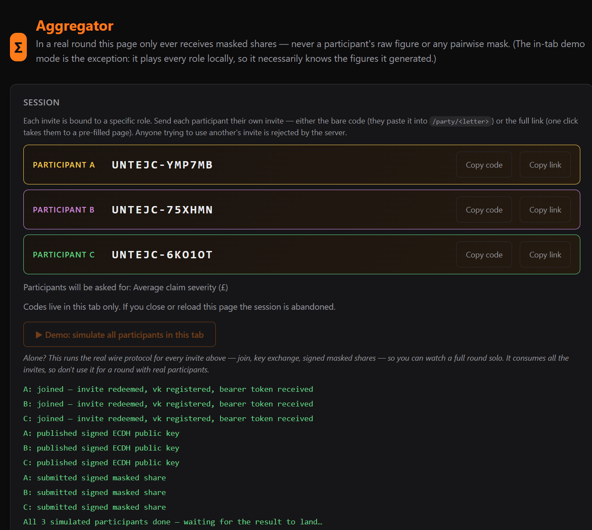

# Cravage

**Get the average, not the secrets.**

The name is a blend of **cr**yptographic **av**er**age** (pronounced "kruh-VAHZH", rhymes with "mirage"), and that is exactly what it does: Cravage lets three to ten participants compute a shared average while keeping their raw figures private. Each figure stays in the participant's browser; only masked shares reach the server, and the group learns the average, not the inputs.



*A completed round on the [live deployment](https://fl-wg-smpc.fly.dev/): the average, plus the simulation-only reveal that re-derives (Σ x)/N from the raw figures and confirms it matches the result computed from masked shares alone.*

**Compute a group average without pooling raw inputs - and check the result yourself.** Three to ten people each hold one private figure; together they learn only the average, and no participant's raw figure ever crosses the wire. Under the hood, Cravage demonstrates secure multi-party computation: security comes from *pairwise one-time-pad masking*, where every pair shares a random mask that cancels when all N masked shares are summed.

*Built by **Dylan Liew** as a portfolio demonstration of applied secure multi-party computation - the cryptography, the threat modelling, and an honestly documented set of limits.*
&nbsp; [**Run the live solo demo**](https://fl-wg-smpc.fly.dev/aggregator?demo=1) · [How it works](#protocol) · [What it deliberately isn't](#known-limitations)

**Privacy you don't have to take on trust.** Most "we do MPC" demos can't be checked by the viewer; this one can. Every result is independently verifiable:

- each participant's page recomputes the sum and re-verifies *every* signature (Step 6);
- [`verify_round.py`](verify_round.py) replays the whole wire protocol headless as a genuine second implementation;
- the solo-demo **reveal card** (the image above) re-derives (Σ x)/N from the raw figures and shows it matches the result computed from masked shares alone.

**Reviewed like a small safety-critical system.** Larger changes went through a lightweight review-council workflow before implementation: scope the proposal, ask only the relevant expert lenses for isolated opinions, include a challenger, reconcile disagreements, then move only after an explicit go/revise/no-go recommendation. This isn't just a claim - [`docs/review/`](docs/review/) publishes the campaign summary (three independent multi-domain audit passes, a fully resolved 56-item release board, zero refutations on re-review) and two verbatim council transcripts.



**Where it's useful.** Any group that wants a shared statistic but can't pool the raw inputs. A toy version of the problem can arise in insurance: competing firms may want a market-average claim severity, but raw-book pooling creates obvious sensitivity and governance problems. The same shape fits salary benchmarking (a team learns its average pay without anyone revealing their own number) or any consortium comparing sensitive figures. The app stays deliberately generic - you name each round for whatever's being benchmarked, and insurance is only the pre-filled example.

> **Demonstration project.** This is a portfolio proof-of-concept showing the mechanics of
> privacy-preserving secure aggregation. It is **not** a production or commercial service, is
> provided **as-is with no warranty**, and runs as a single in-memory instance with no persistence
> or support. Please don't enter real, sensitive, regulated, confidential, or production data. The
> "insurance claim severity" wording is only an illustrative example metric.

---

## Protocol


*Broadly how it works - not every detail. Each pair's mask is derived **locally** and **never transmitted**; only the masked shares are sent, and the aggregator sums them so every `+`mask meets its `−`mask and cancels, revealing only Σ xᵢ (and hence the average). There's no peer-to-peer link - parties exchange only **public keys via the server**, so the server and aggregator never see a raw figure or a mask. It also omits the integrity layer (each share is ECDSA-signed and server-verified). Privacy assumes honest, non-colluding parties - see [Known limitations](#known-limitations).*



*Masked shares look like random integers; every pairwise mask appears once with + and once with −, so summing all N cancels them and reveals only Σ xᵢ (and hence the average).*

For every pair `(i, j)` with `i < j`, a 64-bit mask `r_ij` is **derived locally by both participants** from an ECDH shared secret - neither sends the mask to anyone, and the coordinator never sees it. Each participant `k` then computes a local masked share:

```
s_k = x_k + Σ r_kj  (for j > k)  − Σ r_jk  (for j < k)
```

So for a 3-party round the shares look like:

```
s_A = x_A + r_AB + r_AC
s_B = x_B − r_AB + r_BC
s_C = x_C − r_AC − r_BC
```

…and the same shape generalises to any 3-10 participants. Only the masked shares are sent to the aggregator. Every mask appears once with `+` and once with `−`, so:

```
Σ s_k = Σ x_k        (all masks cancel)
average = Σ s_k / N
```

The aggregator learns only the sum (and therefore the average). Individual figures remain private.

Mask derivation uses **ECDH P-256 + HKDF-SHA256** in the browser:
- Each participant generates an ECDH keypair locally; private keys never leave the browser.
- Each participant publishes only their **public key** to the coordinator.
- For each pair, both parties run `ECDH(myPriv, theirPub)` to derive the same 32-byte shared secret, then expand it via HKDF (with a deterministic per-pair info string) into the 64-bit mask `r_ij`.
- The coordinator only ever sees public keys and masked shares - it cannot derive any mask, even in collusion with one participant.

---

## Running it



*The aggregator page: per-participant invites to share out-of-band, plus the solo-demo button that runs every role in one tab over the real wire protocol.*

Requires Python 3.7+ and `cryptography` for ECDSA P-256 signature verification.

```bash
pip install -r requirements.txt
python server.py
```

Then open each page in a **separate** browser tab or window:

| Role        | URL                                            |
| ----------- | ---------------------------------------------- |
| Home        | <http://127.0.0.1:8765/>                       |
| Participant | <http://127.0.0.1:8765/party/A> through `/party/J` |
| Aggregator  | <http://127.0.0.1:8765/aggregator>             |

> **Cross-device / LAN demos need a secure context.** The in-browser crypto (WebCrypto) only runs on **HTTPS** or **`http://localhost`**. A plain-HTTP LAN address (e.g. `http://192.168.x.x:8765`) is *not* a secure context, so the participant pages and the solo demo detect this and refuse to run with a clear message rather than failing cryptically. To demo across phones/devices, use the HTTPS deployment URL (or an HTTPS tunnel).

The aggregator opens their page, optionally names what's being benchmarked (free text, pre-filled with the example "Average claim severity (£)" - e.g. competing insurers privately computing the market's average claim cost), picks how many participants (3-10) will join, and clicks **Create session**. The metric label is shown to each participant before they enter their figure and on every result card; leave it blank for a fully generic round. The server mints a unique 6-character session code plus N per-party invite tokens and returns one combined invite per participant in the form `SESSION-TOKEN`. The aggregator shares each invite with its matching participant out-of-band (Slack, email, etc.) - each code is bound to a specific role, so a participant holding A's invite cannot claim slot B. Each participant enters their invite on their own page before submitting a figure.

Each participant enters their figure and clicks *Start Protocol*. Once all N shares have been submitted, each participant's page independently recomputes the sum from the N public masked shares (a quick cross-check against the aggregator), and the aggregator page reveals the average.

### Try it alone

Open [`/aggregator?demo=1`](https://fl-wg-smpc.fly.dev/aggregator?demo=1) to create a 3-party session and run the simulator automatically. The normal aggregator page also offers **Demo: simulate all participants in this tab** after you create a session. It runs every participant's side of the protocol - proof-of-work, join, signed key exchange, mask derivation, signed masked shares - over the real wire, with random figures, so you can watch a complete round solo. The 3-party default is the smallest teaching example, chosen because the mask cancellation is easy to see; it is not a claim that tiny groups provide strong real-world privacy. Two honest caveats, which the page itself displays: a simulated round has no privacy (one tab necessarily knows every figure - that's why the page shows a reveal card at the end, something nobody can produce in a real round), and the simulation consumes all the session's invites, so create a fresh session for rounds with real participants.

For the public live demo, leave both `SITE_PASSWORD` and `AGGREGATOR_PASSWORD` unset. `AGGREGATOR_PASSWORD` protects `GET /aggregator`, so it also blocks the one-click `/aggregator?demo=1` route before the simulator can start.

To abandon an in-flight round, reload the aggregator page and create a new one; old sessions live in memory until the server restarts.

### Making the whole site private

To take the **entire site offline behind a password** - every page, the demo, and the APIs, so nobody can see it until you're ready to share - set `SITE_PASSWORD`:

```bash
fly secrets set SITE_PASSWORD='something-only-you-know'   # then: fly deploy
```

The browser shows a native auth dialog on first visit; only `/healthz` stays open (so the platform's health check keeps the machine up). It's a single shared secret (no per-user accounts) - a "coming soon" curtain, not fine-grained access control. Lift it any time with `fly secrets unset SITE_PASSWORD` (then `fly deploy`). Leave it unset for normal public/dev operation. This is separate from the aggregator password below.

### Restricting who can create sessions

Set `AGGREGATOR_PASSWORD` to a shared secret of your choice and restart the server:

```bash
AGGREGATOR_PASSWORD='something-only-you-know' python server.py     # macOS / Linux
set AGGREGATOR_PASSWORD=something-only-you-know && python server.py # Windows cmd
$env:AGGREGATOR_PASSWORD='something-only-you-know'; python server.py # PowerShell
```

When the variable is set, three things are gated:

- **`GET /aggregator`** - the page itself. Visiting it triggers the browser's native HTTP Basic Auth dialog (the username field is ignored; only the password is checked). Unauthorized visitors can't even see the form.
- **`POST /api/session/new`** - session creation.
- **`POST /api/reset`** - session deletion.

The server accepts three auth forms (constant-time compared): `Authorization: Bearer <password>` (curl/scripts), `Authorization: Basic <b64(user:pw)>` (browser dialog; username ignored), or a signed `agg` cookie. The cookie is minted by the server when `/aggregator` clears Basic Auth and is what the browser actually presents on subsequent `fetch()` calls - browsers cache Basic Auth creds but won't pre-emptively attach them to fetch, so the cookie carries the page-load auth across to `/api/session/new`. The aggregator page does no password handling itself. Participants don't need the password - their per-party invite token still gates `/api/join`, and the participant pages are not behind the auth gate. Leaving the variable unset keeps session creation open, which is the intended public-demo configuration.

If the Fly deployment should be public and self-serve, remove the secret and redeploy:

```bash
fly secrets unset AGGREGATOR_PASSWORD
fly deploy
```

Browser Basic Auth has no clean logout: closing the browser clears the cached credentials. That's a known UX wart of the protocol.

This is a single shared secret with no per-user attribution. For real access control (revocable per person, audit log, MFA), put the whole app behind an identity proxy such as Cloudflare Access or Tailscale Funnel; `server.py` doesn't need to change.

### Deploying

The repo includes a `Dockerfile` and respects `HOST` / `PORT` env vars (defaulting to `0.0.0.0:8765`), so any container PaaS that injects `PORT` (Fly.io, Render, Cloud Run, Railway) will work out of the box. **Pin to exactly one always-on instance** - protocol state is in process memory, so autoscaling or scale-to-zero will break rounds in flight. Health-check path is `/healthz`.

For the public Fly demo, keep `SITE_PASSWORD` and `AGGREGATOR_PASSWORD` unset. The proof-of-work and per-IP rate limits are the public-demo guardrails; setting `AGGREGATOR_PASSWORD` makes the one-click solo demo ask for the aggregator password.

#### Optional: custom domain + Cloudflare in front

Worth doing if you're sharing the demo publicly: ~£10/yr for a domain buys a presentable URL, and Cloudflare's free tier adds WAF/bot mitigation in front of the proof-of-work layer plus traffic analytics - useful since the app's only other observability is the stdout access log. Note Cloudflare cannot proxy a `*.fly.dev` address; the custom domain is the prerequisite.

1. Buy a domain and add the site to Cloudflare. Create a proxied (orange-cloud) `CNAME` (or `A`) record pointing at the fly app.
2. Run `fly certs add <domain>` so fly can terminate TLS for the new hostname. Cloudflare's proxying can interfere with the ACME HTTP-01 challenge - if issuance stalls, temporarily grey-cloud the record or use the DNS-01 instructions `fly certs` prints.
3. Set the Cloudflare SSL/TLS mode to **Full (strict)**. Never "Flexible" - that downgrades the Cloudflare→fly hop to plain HTTP behind your back.
4. Run `fly secrets set TRUST_CF_CONNECTING_IP=1` so per-IP rate limiting keys on the real client address (`CF-Connecting-IP`) instead of Cloudflare's shared egress IPs, which would lump unrelated visitors into one bucket. Leave this unset on deployments without Cloudflare - fly passes unknown client headers through, so trusting it unconditionally would let clients spoof their rate-limit identity.
5. Nothing else changes: with Full (strict), fly's edge still sees HTTPS and keeps setting `X-Forwarded-Proto: https`, so the aggregator cookie's `Secure` flag behaves as before.

To verify after cut-over: `curl -I https://<domain>/healthz` should return 200 with a `server: cloudflare` header; the aggregator login + cookie flow should work on the new domain; and hitting a rate limit from one network shouldn't affect a client on another.

---

## Project layout

```
SMPC/
├── server.py              # Python stdlib HTTP server: relays masks, collects masked shares
├── public/
│   ├── home.html          # Landing page with links to each role
│   ├── party.html         # Per-participant page (served for /party/a … /party/j)
│   ├── aggregator.html
│   └── static/
│       ├── pow.js         # Pure-JS SHA-256 proof-of-work miner
│       ├── smpc-core.js   # Shared protocol crypto and exact fixed-point display helpers
│       └── theme.css      # Shared palette/focus/honesty/disclaimer styling
├── Dockerfile             # python:3.11-slim, drops to non-root uid 1000
├── fly.toml               # Single pinned machine - in-memory state can't autoscale
└── examples/
    └── single-page-demo.html   # Earlier standalone single-page demo (kept as a reference)
```

### Server endpoints

A participant's first POST is `/api/join` with `(session, party, token, vk)` - they redeem their invite token and register their ECDSA verifying key. The server returns a server-signed bearer token (HMAC-SHA256 over `{session, party, vk, exp}`). All subsequent party-scoped POSTs carry that bearer token plus an ECDSA signature over a canonical `<action>|<session>|<party>|<content>` message; the server verifies its own HMAC, extracts the registered vk, and verifies the share/pubkey signature against it. Read-only observation endpoints require only a `session=` query param. POSTs with `Content-Length > 16 KB` return `413`.

- `POST /api/session/new` - mint a new session of size `n` (3-10, default 3). Body `{n}` optional. Returns `{code, tokens: {<role>: <token>}, parties: [<role>, …]}`. Gated by the aggregator password (see *Restricting who can create sessions* below) when `AGGREGATOR_PASSWORD` is set
- `POST /api/join` - redeem an invite, register a signing vk, receive a bearer token (`{session, party, token, vk}` → `{server_token}`)
- `POST /api/pubkey` - publish an ECDH public key, signed (`{server_token, pubkey, sig}`)
- `POST /api/share` - submit a final masked share, signed (`{server_token, share, sig}`)
- `GET  /api/pubkeys?for=X&session=...` - participant `X` fetches the other two participants' ECDH pubkeys
- `GET  /api/result?session=...` - masked shares + their signatures + the registered vks + the sum, once all three are in. The aggregator and the participants both use this to recompute the sum AND independently verify each share's signature
- `GET  /api/state?session=...` - which participants have submitted so far in this session
- `POST /api/reset` - delete the given session (`{session}`); useful for abandoning a round. Gated by the aggregator password when `AGGREGATOR_PASSWORD` is set
- `GET  /healthz` - unprotected liveness probe for platform health checks

---

## Known limitations

This is a deliberately lightweight educational demo. The boundaries below are known and, in most
cases, intentional - listed here so they're explicit rather than discovered. Deeper rationale for
the security-specific points is in *Security notes* immediately below; production-readiness notes
live in [`docs/PRODUCTION_READINESS_PLAN.md`](docs/PRODUCTION_READINESS_PLAN.md).

- **All participants must be online together; there is no dropout handling.** If any participant
  fails to submit, the round stalls - there's no threshold mask-sharing to recover the aggregate
  from a partial set, as production secure-aggregation has.
- **Not production-grade and not persistent.** A single in-memory instance: all state is lost on
  restart, sessions are auto-deleted after ~30 minutes, and it must run as exactly one always-on
  instance (it can't be horizontally scaled). The single-instance pin is enforced in config -
  `fly.toml` caps both `min_machines_running` and `max_machines_running` at 1 - so an accidental
  scale-out or a rolling-restart overlap can't split a session across machines with disjoint state
  (a rolling deploy therefore has a few seconds of downtime, which is fine for this demo).
- **No input-honesty guarantee and no figure caps.** A participant can submit any value
  (including a very large one) and skew the average; signatures prove *who* submitted and that it
  wasn't tampered with by others, not that the figure is truthful or reasonable. The absence of a
  magnitude cap is a deliberate choice (any figure scale must work).
- **Signed shares do not stop impersonation.** Identities are generated per-session in the
  browser, so an interceptor who races to claim an invite first can pose as that participant
  convincingly. Closing this needs a pre-established identity/key registry - out of scope.
- **Collusion has a floor.** Enough colluding participants (or one plus the aggregator) can
  reconstruct a remaining honest participant's figure. This is inherent to pairwise masking.
- **The final statistic can still be sensitive.** SMPC hides individual inputs; it does not
  automatically make the resulting average safe to publish or share. Small groups, collusion,
  prior knowledge, or repeated overlapping rounds can still leak information through the aggregate.
- **Coarse access control.** A single shared aggregator password with no per-user attribution;
  for real access control, front the app with an identity proxy.
- **Anyone with a session code can read that round's metadata** (label, roster, masked shares,
  signatures, the average) - though never the raw individual figures. Treat the code as a
  read capability.
- **Abuse controls depend on the hosting topology.** Per-IP rate limiting relies on the
  platform's trusted client-IP header; on a direct/forwarding exposure it can be bypassed.
- **Operational choices for a wider public deployment**: no availability monitoring and no
  moderation of the free-text metric label - both
  accepted as out of proportion for a single-instance portfolio demo. A live load check has established
  enough headroom for realistic portfolio traffic. The data-protection footprint is documented in
  *Privacy* below.

---

## Security notes

This is an educational demo, not production-grade:

- **Mask derivation is end-to-end.** Each pair derives its mask via ECDH P-256 + HKDF-SHA256 in the browser; private keys never leave the browser, masks are never transmitted, and the coordinator only sees public keys and masked shares. A coordinator colluding with one participant can no longer recover another participant's input.
- **Per-party invite tokens** redeemed at `/api/join` gate which party slot a request can claim.
- **Server-signed bearer tokens** (HMAC-SHA256) committing to `(session, party, vk)` replace the raw invite for subsequent POSTs. Tamper-proof and stateless: the server re-verifies its own HMAC instead of remembering tokens.
- **ECDSA P-256 signed shares.** Every `/api/pubkey` and `/api/share` POST carries a signature over `"<action>|<session>|<party>|<content>"`. The server verifies it against the vk registered at `/api/join`. `/api/result` returns each share's signature and vk so the aggregator and other participants can independently re-verify and recompute the sum - a dishonest aggregator can be caught.
- **First-write-wins on slot writes.** Once a participant has committed a vk, ECDH pubkey, or masked share, that value is locked. Identical-content retries succeed (network glitches don't strand you); any rewrite returns 409. This closes the share-rewriting attack where a participant could otherwise wait for everyone else's submission and then overwrite their own share to nudge the average.
- **Container runs as a non-root user.** The Dockerfile creates `app` (uid 1000) and switches to it before `CMD`. Containers are isolated boxes on the host; by default the process inside runs as `root`, the all-powerful admin. If a bug ever lets an attacker run shell commands inside the container, root means immediate admin rights - and if they then chain a container-escape exploit, they land on the host with more power than they need. Running as a regular user is defence in depth: doesn't stop bugs, just shrinks the blast radius of any chained exploit.
- **`X-Frame-Options: DENY`** on every response, blocking clickjacking. Web pages can be embedded inside other pages via `<iframe>`; an attacker exploits this by building a malicious page with our aggregator UI invisibly layered on top of fake bait - say, a "Click here to claim your prize" button positioned exactly where the real **Create session** button sits. The user thinks they're clicking the prize and actually clicks through into the framed real app. The header tells browsers "never embed this page in a frame, period" - there's no legitimate reason to iframe our own UI, so the defence has no cost.
- **Optional aggregator password.** When `AGGREGATOR_PASSWORD` is set, the aggregator page itself (`GET /aggregator`) plus `POST /api/session/new` and `POST /api/reset` require auth - the page via HTTP Basic Auth (browser dialog), the API endpoints accepting either Basic or `Bearer`. Constant-time compare. This also blocks `/aggregator?demo=1`, so leave it unset for the public self-serve solo demo. Single shared secret with no per-user attribution - for real access control put the app behind an identity proxy. See *Restricting who can create sessions*.
- **Per-IP rate limits** (sliding window) on `/api/session/new` (10/min), `/api/join`/`/api/pubkey`/`/api/share`/`/api/reset` (30/min each), `/api/pow-challenge` (60/min). Caps memory-DoS via session-creation flooding, ECDSA-verify CPU exhaustion, and brute-force invite-token guessing. Read endpoints are unlimited. The rate-counter map itself is swept every minute by the session reaper to drop entries whose IPs haven't been seen this window - without that sweep, the map kept a permanent key for every IP that ever hit the server (it's like a guestbook where you cross out old visitors but never tear out the empty pages: it grows forever even though the visitor information is gone).
- **Proof-of-work** on `/api/session/new` and `/api/join`. Client mines `SHA-256(challenge:n)` until it clears a difficulty bar; server verifies in one hash op. The challenge is HMAC-signed by the server (so attackers can't mint easy challenges) and spend-once (so a mined solution can't be replayed). Pegs the per-request cost to ~0.5-2s of CPU regardless of source IP, complementing the rate limiter (which only caps single sources). Difficulty knob: `POW_DIFFICULTY` in `server.py`. The dict that tracks already-spent challenge IDs is swept both on incoming requests and on the session-reaper thread, so an idle server doesn't hold onto expired markers forever (each puzzle ID expires after 60s - they have to stay in memory just long enough that the same solution can't be replayed).
- **Session TTL.** A background reaper deletes sessions older than `SESSION_TTL_SECS` (default 30 min, matching the bearer-token TTL). Bounds memory growth even if an attacker drips session-creation requests in below the rate-limit cap.
- **Honest limitation: signed shares do NOT close the impersonation race.** vks are generated per-session in the browser. An attacker who intercepts an invite and races the legitimate participant to `/api/join` registers their own vk; subsequent signatures verify cleanly. Closing this gap requires a long-term per-participant key registry (or two-channel delivery, or federated identity) that binds vk to participant identity *before* the session begins. Not implemented here.
- **Unbounded share magnitude.** `/api/share` accepts any decimal string - nothing caps the number. A malicious or buggy participant can drag the average by submitting a huge value. Signatures don't help: they only prove who submitted, not what was reasonable.
- **No party-identity authentication beyond the token.** A legitimate holder of an invite token is still trusted to honestly submit *their own* figure - the protocol doesn't prevent a participant from entering whatever number they like as `x_i`.
- **Fixed-point arithmetic** (×10⁶) is used so decimals work with BigInt on the client. The browser parses plain ASCII decimal input directly into that fixed-point integer - no `Number`, exponent notation, commas, or non-ASCII digits - and internal arithmetic keeps the full precision. The average, sum, and reveal cross-check are **displayed to at most 2 decimal places** (display rounding only - the masks-cancel verification stays exact).
- **Collusion.** As with any pairwise-masking scheme, two colluding participants (or a participant colluding with the aggregator) can reconstruct the third participant's input - this is inherent to 3-party additive secret sharing.

## Privacy

This is a demonstration that deliberately keeps as little as possible, all in memory:

- **No accounts, no analytics, no third-party trackers.** Nothing is persisted to disk - all session state lives in memory and is wiped on restart or after the ~30-minute session TTL.
- **IP addresses** are held briefly in memory for per-IP rate limiting, and may appear in the server's minimal stdout access log (one line per POST - time, IP, method, path, status; never request bodies, tokens, or query strings). These are ephemeral platform logs, not a database.
- **Functional cookies only, and only when a password is configured.** In the default fully-public
  configuration **no cookies are set at all**. Two cookies can appear: `agg`, set on the aggregator
  page when an aggregator password is configured (to carry that login across to the API endpoints);
  and `site`, set on **every** page when the whole-site password (`SITE_PASSWORD`) is enabled. Both
  are `HttpOnly`, `SameSite=Strict`, and self-expiring - functional auth cookies, not tracking.
- **Your figure never leaves your browser** - see the protocol above.

## License

This project is licensed under the MIT License - see [`LICENSE`](LICENSE).

## Changelog

Notable hardening and UX changes are collected in [`docs/CHANGELOG.md`](docs/CHANGELOG.md).

---

Built by **Dylan Liew** as a portfolio project. Source: [github.com/dylanil/SMPC](https://github.com/dylanil/SMPC).
